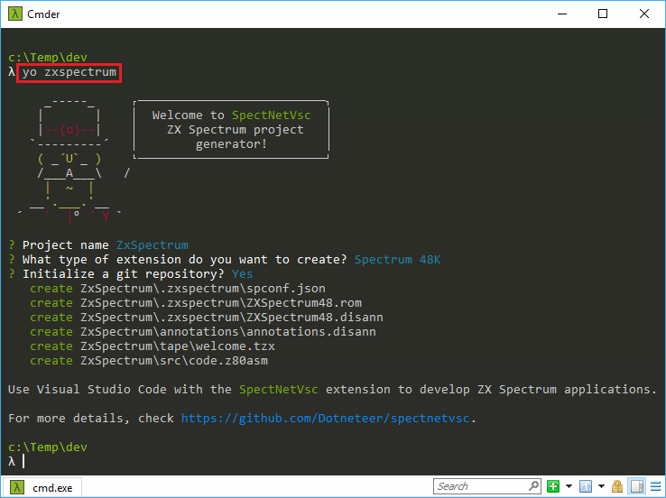
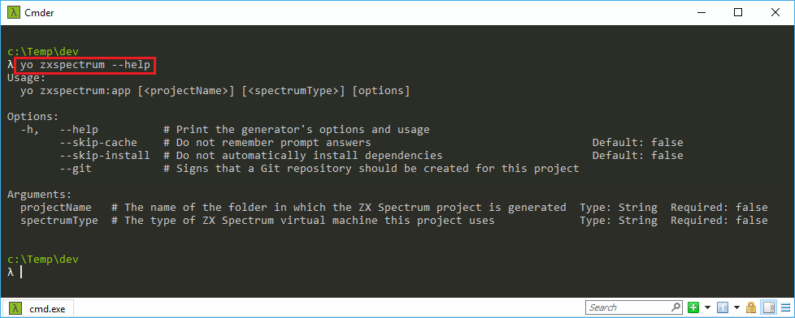

_This project is under construction_.
# ZX Spectrum Project Generator
This project is a `yo` (Yeoman) generator for the [SpectNetVsc](https://github.com/Dotneteer/spectnetvsc) Visual Studio Code extension. Though you can use it alone, it is not useful without __SpectNetVsc__.

## Prerequisits

To use this generator, you need to install [yeoman](http://yeoman.io/):

```
npm install -g yo
```

The ZX Spectrum project generator can create a local Git repository for you. If you want to do so, install a Git command line client on your computer and make its binary available (add its folder to the search path).

> Note: The ZX Spectrum generator has not been published yet, so you cannot install it with `npm`.

## Using the Generator

Navigate to a root folder into which you want to generate a ZX Spectrum project, and use the `yo` command line:

```
yo zxspectrum [<project folder>] [<ZX Spectrum Type>] --git
```

_project folder_: Name the folder to generate the project within the current directory.  
_ZX Spectrum Type_: The type of the ZX Spectrum virtual machine the project will use. You can use one of these type identifiers:
* `48`: ZX Spectrum 48K
* `48NTSC`: ZX Spectrum 48K, NTSC model
* `128`: ZX Spectrum 128K
* `+2A`: ZX Spectrum +2A
* `+3F1`: ZX Spectrum +3 model with a single floppy drive
* `+3F2`: ZX Spectrum +3 model with double floppy drive

`--git`: Signs that you want to create a Git repository for the project  
`--no-git`: Signs that you do not intend to create a Git repository

If you omit any of the command line argument (including `--git` or `--no-git`), the generator will prompt you for providing those arguments. Should you specify a non-existing ZX Spectrum type, the generator will allow you to select them from its option list.



With the `yo zxspectrum --help` command, you can display the description of arguments and options.



## Contact

If you have questions, you can contact me: dotneteer@hotmail.com
